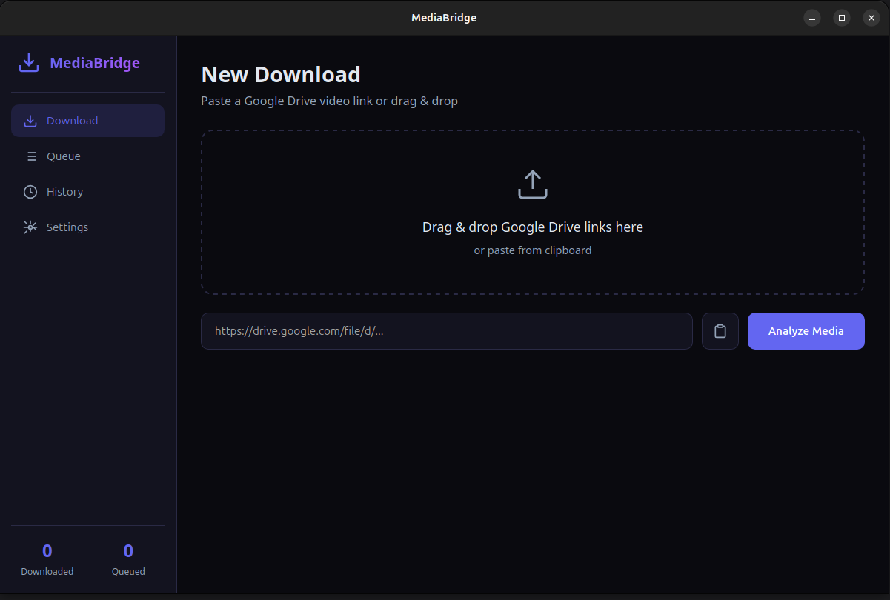
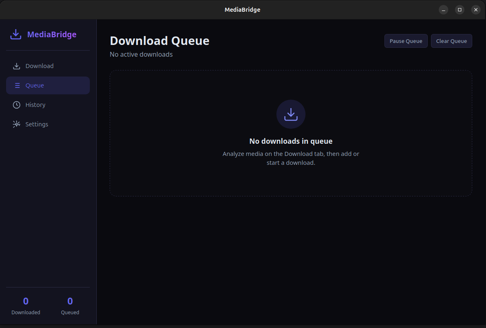
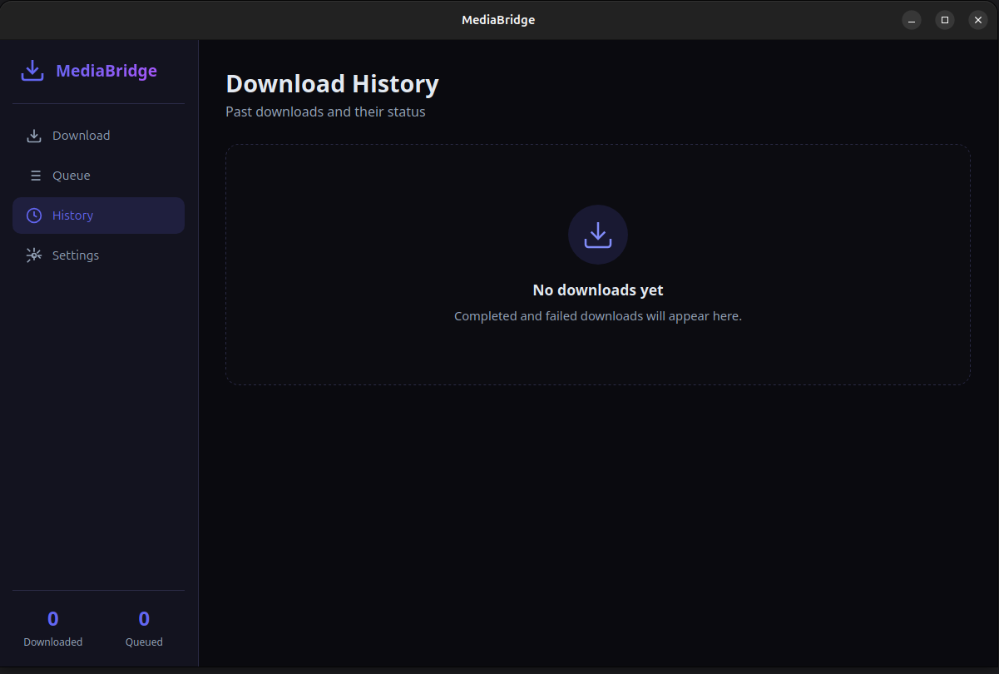
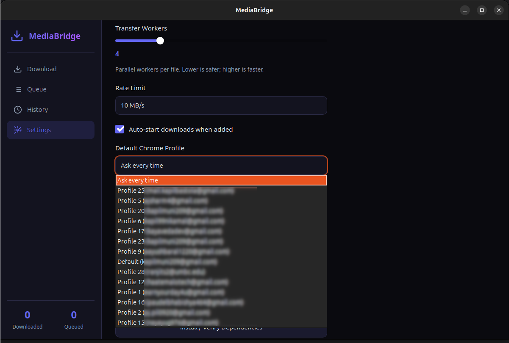

# MediaBridge

Cross-platform desktop application for personal media management and offline access.

MediaBridge provides a streamlined workflow for downloading, organizing, and processing media files through a simple desktop interface.

## Download

Download the latest version from the **Releases** section of this repository.

### Supported Platforms

* Windows (x64)
* macOS (Intel & Apple Silicon)
* Linux (x86_64, ARM64)

## Features

* Modern desktop interface
* Download queue management
* Pause and resume support
* Automatic dependency setup
* Media processing and conversion
* Download history and logging
* Cross-platform support

## Screenshots

### Home

### Queue

### History

### Settings

## Installation

1. Open the **Releases** section.
2. Download the installer for your operating system.
3. Run the installer.
4. Launch MediaBridge.

## Support

If you encounter a problem:

1. Check the latest release notes.
2. Search existing issues.
3. Open a new issue with relevant logs and reproduction steps.

## Changelog

See [CHANGELOG.md](CHANGELOG.md) for release history.

## License

All rights reserved unless otherwise specified.
